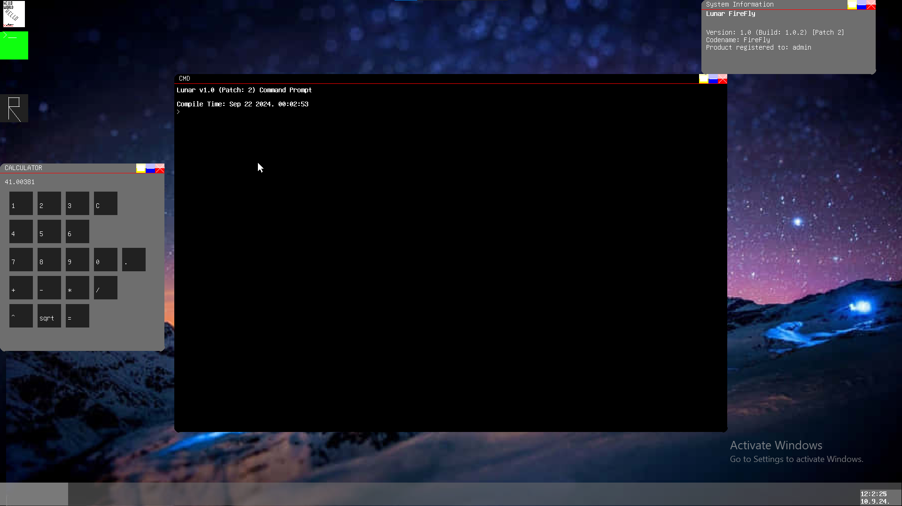

# Lunar 1.0
### Release 1.0
#### Patch 3 // Build 1.0.3


## Contributing

DM me on discord to get the source code\
Discord: vuledjk


## Authors

- [@Vuk5001](https://github.com/Vuk5001)


## Roadmap

- USB
- NIC
- Web browser
- Ray tracing support in DepthRenderer
- More GPU's supported
- Sound Cards


## Running Lunar

To run the OS in a Virtual Machine (QEMU) use these params

```bash
  {qemu-version} -net nic,model=pcnet -drive file=Lunar.img -m 256M -machine q35 -cpu max -drive if=pflash,format=raw,unit=0,file=CODE.fd,readonly=on -drive if=pflash,format=raw,unit=1,file=VARS.fd -display sdl
```

To run it on real hardware, its a bit harder, I recommend using RUFUS and make a bootable USB\
Keep in mind your test machine NEEDS to support (U)EFI Boot! You DONT need TianoCore stuff to boot, you
can use any other frimware you have, even on real HW.

For VBox, VMWare, these do not work (for now).

## System Requirements
(YOU NEED A COMPATIBLE UEFI SYSTEM, THERE IS NO LEGACY BOOTLOADER)
- HDD: 3MB
- CPU: 64 bit compatible CPU
- GPU: recommended to use one (supported: VMWare SVGA II, Intel HD, AMD (RDNA 3)) (if gpu isnt present, cpu will take over the rendering)
- RAM: 512MB
- Network: none or AMD PCnet
- Display: 1920x1080
- Audio: none

## Known Bugs
- DepthRenderer doesnt fallback to VMWareSVGA II or CPU Renderer if Intel HD graphics arent present (leaving the Render button unusable)
- DepthRenderer doesnt use the new mesh renderer :(

## Screenshots



